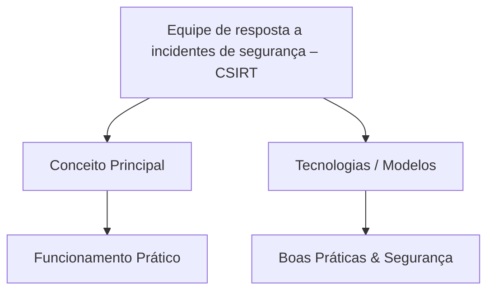

# Resumo da Matéria: Gestão da Segurança e Continuidade
## UA 4 - Gestão de incidentes de segurança da informação - Aula 05: Equipe de resposta a incidentes de segurança – CSIRT

> **Curso:** Gestão da TI | **Período:** 3º Período  
> **Módulo:** Modelagem e Segurança da Informação  
> **Disciplina:** Gestão da Segurança e Continuidade  
> **Unidade:** UA 4 - Gestão de incidentes de segurança da informação  
> **Aula:** 05 - Equipe de resposta a incidentes de segurança – CSIRT  
> **Carga de Vídeo:** ~23 min 09 s (3 blocos de vídeo)

---

## 📂 Checklist de Materiais Baixados
- [ ] `PDF da Matéria`: `Equipe de resposta a incidentes de segurança – CSIRT.pdf`
- [ ] `PDF de Slides`: `Slides - Equipe de resposta a incidentes de segurança - CSIRT.pdf`
- [ ] `Áudios`: MP3 das videoaulas
- [ ] `Legendas/Transcrições`: VTT / SRT / TXT
- [ ] `Resumo Gerado`: Markdown pronto para revisão

---

## 🎬 Blocos de Videoaulas
- **Parte 01:** Equipe de Resposta a Incidentes de Segurança - CSIRT (07:29) - *Prof. Francisco Adair dos Santos Júnior*
- **Parte 02:** Equipe de Resposta a Incidentes de Segurança - CSIRT II (07:15) - *Prof. Francisco Adair dos Santos Júnior*
- **Parte 03:** Equipe de Resposta a Incidentes de Segurança - CSIRT III (08:25) - *Prof. Francisco Adair dos Santos Júnior*

---

## 🎯 Objetivos de Aprendizagem
- [ ] Compreender os conceitos principais de **Equipe de resposta a incidentes de segurança – CSIRT**.
- [ ] Conectar os fundamentos com as aplicações práticas em **Gestão da Segurança e Continuidade**.
- [ ] Consolidar pontos críticos para exames e questionários (Quiz / Check de Aprendizagem).

---

## 📝 Resumo Consolidado (Para NotebookLM / Gemini)

### 1. Visão Geral e Conceitos Fundamentais
*Insira aqui o resumo gerado pelo Gemini / NotebookLM ou suas anotações principais.*

- **Conceito Chave 1:** 
- **Conceito Chave 2:** 
- **Conceito Chave 3:** 

### 2. Tópicos Abordados
*Resumo detalhado dos blocos de vídeo e do livro-texto.*

### 3. Tabela de Termos Técnicos, Siglas e Protocolos
| Termo / Sigla | Definição / Significado | Aplicação Prática |
| :--- | :--- | :--- |
| | | |
| | | |

---

## 🧠 Mapa Mental / Diagrama de Fluxo (Mermaid)

---

## ❓ Perguntas de Fixação & Flashcards (Estudo Ativo)
1. **Pergunta:** 
   - **Resposta:** 
2. **Pergunta:** 
   - **Resposta:** 

---

## 💡 Dicas de Estudo
- Faça o **Check de Aprendizagem** e o **Quiz da UA** após revisar este resumo.
- Para gerar novas perguntas e simular testes, carregue este arquivo + o PDF da matéria no **NotebookLM** ou **Gemini**.
